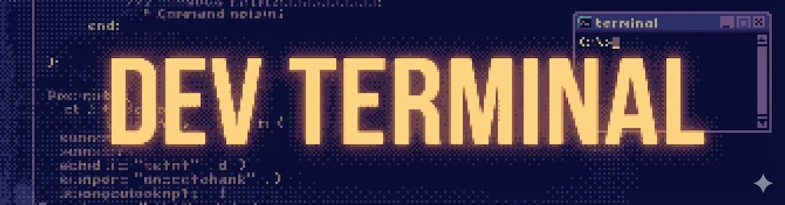

<p align="center">
  
</p>

Terminal automation for AI assistants. Inspired by [dev-browser](https://github.com/sawyerhood/dev-browser).

**Key features:**

- **Persistent sessions** - Create once, interact across multiple scripts
- **SSH support** - Connect to remote servers with the same API
- **Headed mode** - Browser UI to watch AI actions in real-time
- **Full PTY support** - Run interactive TUI apps (htop, vim, ncurses, etc.)
- **LLM-friendly snapshots** - Text, ANSI, or SVG output for AI analysis

## Installation

### Claude Code Plugin

```
/install parkerhancock/dev-terminal
```

Restart Claude Code after installation.

### Manual / Standalone

Requires [Node.js](https://nodejs.org) v18+.

```bash
git clone https://github.com/parkerhancock/dev-terminal
cd dev-terminal && npm install
```

## Quick Start

Start the server:

```bash
./server.sh              # Headless
./server.sh --headed     # With browser UI
```

Create and interact with terminals:

```typescript
import { connect, sleep } from "./src/client.js";

const client = await connect();
const term = await client.terminal("my-app");

await term.writeLine("ls -la");
await term.waitForText("total");

const snap = await term.snapshot();
console.log(snap.text);

await term.key("ctrl+c");
client.disconnect();
```

## Client API

### Connection

```typescript
import { connect } from "./src/client.js";

const client = await connect(); // Default: http://localhost:9333
const client = await connect("http://..."); // Custom server URL
```

### Client Methods

```typescript
// Create or reconnect to a named terminal
const term = await client.terminal("name");
const term = await client.terminal("name", options);

// List all terminal names
const names = await client.list();

// Close/kill a terminal
await client.close("name");

// Get server info
const info = await client.info();

// Disconnect (terminals keep running)
client.disconnect();
```

### Terminal Options

```typescript
const term = await client.terminal("name", {
  // Local terminal options
  command: "bash", // Shell or command to run
  args: ["-l"], // Arguments (default: login shell)
  cols: 120, // Width in columns (default: 120)
  rows: 40, // Height in rows (default: 40)
  cwd: "/path/to/dir", // Working directory
  env: { MY_VAR: "value" }, // Additional environment variables

  // SSH options (for remote terminals)
  ssh: {
    host: "example.com", // Required
    username: "deploy", // Required
    port: 22, // Default: 22
    password: "...", // Password auth
    privateKey: "...", // Key content (not path)
    passphrase: "...", // For encrypted keys
    agent: process.env.SSH_AUTH_SOCK, // SSH agent
  },
});
```

### Terminal Methods

```typescript
// Write raw data
await term.write("hello");

// Send a line (adds Enter)
await term.writeLine("ls -la");

// Send special keys
await term.key("enter");
await term.key("ctrl+c");
await term.key("up");

// Get screen snapshot
const snap = await term.snapshot();
console.log(snap.text); // Plain text (ANSI stripped)
console.log(snap.raw); // Raw output with ANSI codes
console.log(snap.lines); // Array of lines
console.log(snap.alive); // Process still running?
console.log(snap.exitCode); // Exit code if exited

// Get SVG rendering
const snap = await term.snapshot({ format: "svg" });
console.log(snap.svg);

// Resize terminal
await term.resize(80, 24);

// Clear output buffer
await term.clear();

// Wait for text to appear
const found = await term.waitForText("Ready", { timeout: 5000 });

// Wait for process to exit
const code = await term.waitForExit({ timeout: 10000 });
```

### Special Keys

| Category   | Keys                                                                                               |
| ---------- | -------------------------------------------------------------------------------------------------- |
| Arrows     | `up`, `down`, `left`, `right`                                                                      |
| Control    | `enter`, `tab`, `escape`, `backspace`, `delete`                                                    |
| Ctrl+X     | `ctrl+c`, `ctrl+d`, `ctrl+z`, `ctrl+l`, `ctrl+a`, `ctrl+e`, `ctrl+k`, `ctrl+u`, `ctrl+w`, `ctrl+r` |
| Function   | `f1` - `f12`                                                                                       |
| Navigation | `home`, `end`, `pageup`, `pagedown`, `insert`                                                      |

## SSH Remote Terminals

Connect to remote servers via SSH. The API is identical to local terminals.

```typescript
import * as fs from "fs";
import * as os from "os";
import * as path from "path";

// Private key authentication
const term = await client.terminal("server1", {
  ssh: {
    host: "192.168.1.100",
    username: "deploy",
    privateKey: fs.readFileSync(path.join(os.homedir(), ".ssh/id_rsa"), "utf8"),
  },
});

// Password authentication
const term = await client.terminal("server2", {
  ssh: {
    host: "example.com",
    username: "admin",
    password: "secret",
  },
});

// SSH agent (uses existing keys)
const term = await client.terminal("server3", {
  ssh: {
    host: "example.com",
    username: "admin",
    agent: process.env.SSH_AUTH_SOCK,
  },
});

// Custom port + encrypted key
const term = await client.terminal("server4", {
  ssh: {
    host: "example.com",
    port: 2222,
    username: "admin",
    privateKey: fs.readFileSync("/path/to/key", "utf8"),
    passphrase: "key-passphrase",
  },
});
```

**Notes:**

- SSH terminals don't have a local `pid` (returns `undefined`)
- All terminal methods work the same way
- Remote shell is determined by the server

## Headed Mode

Start with `--headed` to open a browser UI:

```bash
./server.sh --headed
```

Features:

- **Live view** - Watch AI actions as they happen
- **Tabs or tiles** - Switch between terminals or view all at once
- **Bidirectional** - Type in browser to interact alongside AI
- **Auto-reconnect** - Reconnects if connection drops

## HTTP API

| Endpoint                               | Method    | Description            |
| -------------------------------------- | --------- | ---------------------- |
| `/terminals`                           | GET       | List all terminals     |
| `/terminals`                           | POST      | Create or get terminal |
| `/terminals/:name`                     | DELETE    | Close terminal         |
| `/terminals/:name/write`               | POST      | Write to terminal      |
| `/terminals/:name/snapshot`            | GET       | Get screen content     |
| `/terminals/:name/snapshot?format=svg` | GET       | Get screen as SVG      |
| `/terminals/:name/resize`              | POST      | Resize terminal        |
| `/terminals/:name/clear`               | POST      | Clear output buffer    |
| `/ws`                                  | WebSocket | Real-time streaming    |

## Architecture

```
┌─────────────────────────────────────────────────┐
│              dev-terminal server                │
├─────────────────────────────────────────────────┤
│  ┌───────────┐ ┌───────────┐ ┌───────────┐     │
│  │ Local PTY │ │ Local PTY │ │  SSH PTY  │     │
│  │  (bash)   │ │  (htop)   │ │ (remote)  │     │
│  └─────┬─────┘ └─────┬─────┘ └─────┬─────┘     │
│        └─────────────┼─────────────┘            │
│              ┌───────┴───────┐                  │
│              │   Registry    │                  │
│              └───────┬───────┘                  │
│        ┌─────────────┼─────────────┐            │
│   ┌────┴────┐   ┌────┴────┐   ┌────┴────┐      │
│   │  HTTP   │   │   WS    │   │ Static  │      │
│   │   API   │   │ Stream  │   │  Files  │      │
│   └────┬────┘   └────┬────┘   └────┬────┘      │
└────────┼─────────────┼─────────────┼────────────┘
         │             │             │
    ┌────┴────┐   ┌────┴────┐   ┌────┴────┐
    │   AI    │   │ Browser │   │ Browser │
    │ Scripts │   │   UI    │   │   UI    │
    └─────────┘   └─────────┘   └─────────┘
```

Like dev-browser maintains persistent browser pages, dev-terminal maintains persistent PTY sessions. Scripts can reconnect to existing terminals without losing state.

## Shell Defaults

By default, local terminals use:

- **Shell**: Your system shell (`$SHELL` env var)
- **Mode**: Login shell (`-l` flag) - loads `~/.zprofile`, `~/.bash_profile`

This means your aliases, PATH, and environment are available.

## Documentation

- [SKILL.md](./SKILL.md) - Detailed usage guide for AI assistants
- [CLAUDE.md](./CLAUDE.md) - Development context

## License

MIT

## Acknowledgments

Inspired by [dev-browser](https://github.com/sawyerhood/dev-browser) by [Sawyer Hood](https://github.com/sawyerhood).
